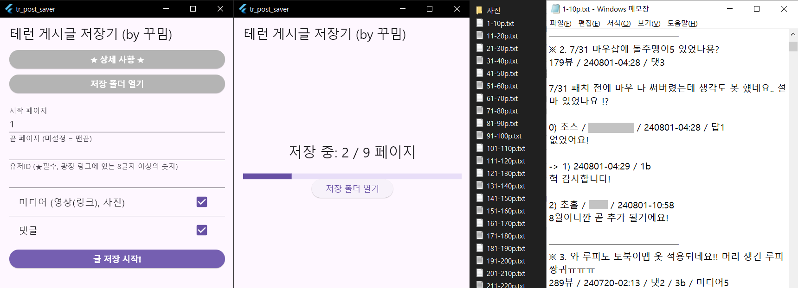

# 테런 게시글 저장기 (by 꾸밈)

본인의 테런 게시글들을 간단 txt로 변환 저장하는 프로그램입니다 (+사진)
 (STOVE 테런 커뮤니티 종료 전 까지 사용 가능 (24/12/11))

- **[★ 다운로드 링크 ★](https://drive.google.com/file/d/1kyzFBn_66mjIoIdpiZLsrRa4yu_Hj2hO/view)**

- **[바이러스 검사 결과](https://www.virustotal.com/gui/file/ca4ef7f28fa76880167fd20c2c7bdb608ab5b5c6b7c35da9987348a67bcd6788)**

## ★ 상세 사항 ★
- **저장 중엔 글 작성/삭제를 피해주세요.**
 (글이 밀려서 중복 저장되며, 추가된 페이지는 저장되지 않습니다.)

- (정상)실행되지 않는 경우
1. (낯선 파일이라) 백신에서 차단하진 않았는지 확인 후 예외 설정
2. exe파일 외에 'dll파일2개, data폴더'가 동일 경로에 있는지 확인 (zip에 동봉)
3. [C++ Redistributable(재배포 가능) 패키지 설치](https://learn.microsoft.com/ko-kr/cpp/windows/latest-supported-vc-redist?view=msvc-170#latest-microsoft-visual-c-redistributable-version)

- 첨부영상을 백업하고 싶으시면 (★커뮤니티 종료 전에)

  txt에서 '(영상 v.'을 검색하면 나오는

  링크에 들어가서 우클릭 저장하시면 됩니다!

  (STOVE 서버 영상 링크라서 글과 함께 삭제될 가능성이 높습니다.)

- 설문은 내용 없이 유무만 표시됩니다.
  설문 내용을 백업하고 싶으시면 (★커뮤니티 종료 전에)
  txt에서 '/ 설문'을 검색하셔서 글 확인 후 직접 캡처하셔야 합니다!

- '페이지'는 STOVE 본인 글 목록 기준입니다. (1페 = 24개)

- 저장 경로 = 내 문서/tr_post_saver (고정)

- 글 = 최신순, 댓글 = 등록순 입니다.

- 런게는 게시판명 표시 X
  -> txt내 런게글 검색을 원하시면
     123뷰 / (창작 /) 240829 이런 형식이니까
     '뷰 / 2~0'으로 검색하시면 됩니다.

- 본인닉/레벨은 변경된 시점에만 표시됩니다!

- b = 좋아요, p = 싫어요 입니다..^^

- 사진 파일명
  x-x = 글번호 - 사진번호
  x-x-x = 글번호 - 댓글번호 - 사진번호

- 문의 = 디스코드 gooserafim

## P . S
삭제가 별안간 4달도 채 남지 않은데다가
 현생도 바쁜데 수동 백업은 엄두도 안 나고... (양이 많을 수록 더욱)
 하지만 '어렸을 때의 흔적들'이 막상 날아간다고 생각하니까 너무 아쉽더라구요ㅜ
 안 그래도 초등학교 때 일기 버린 걸 엄청 후회했어서😥

근데 게시판에 하도 별의별 말을 다 해놔서
 전엔 흑역사라고 생각해서 지우려고도 했었지만
 더 나이 먹고 보니 새록새록 + 방울방울 + 헉! 이런적도 있었다니 그 잡채...
 '내'가 왜 이랬지ㅠ -> '애'였네 ㅎㅎ로 바뀐 느낌?

암튼 이 짧은 기간 내에 최대한 많은 분들이
 '흔적들'을 타의적으로 날리지 않았음 해서
 2주 가량을 갈아 넣어 만들었습니다..

유용하게들 써주신다면 바랄 게 없을 것 같아요!

테런에서 저희가 함께한 것도 벌써 십수년...
앞으로도 좋은 추억이 가득하길,, 행복하세요 총총,, --<-<{@

## License
This project is licensed under the MIT License, which allows anyone to use, modify, and distribute the software freely. For more details, see the [LICENSE](./LICENSE) file.